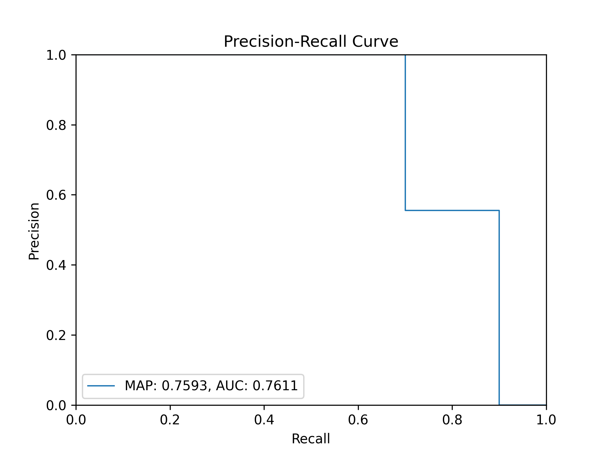
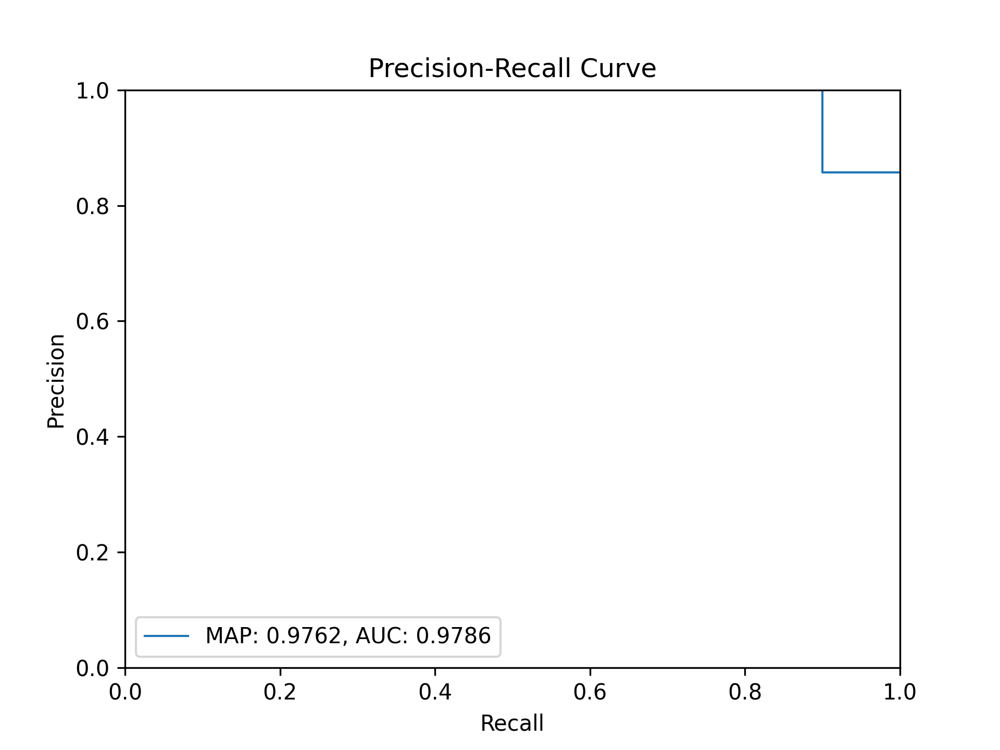

# 1. Search Results Evaluation

With your search system up and running, we can execute queries aimed at satisfying specific information needs.
At this stage, it is important to evaluate the results obtained in a systematic way.
This allows you to get an objective view of your system’s performance and compare different versions of the same base system.

In this short tutorial, we will walk through the evaluation process.
Specifically, we will cover relevance judgments, methods for (semi-)automating these judgments, and common evaluation metrics used to assess system performance.


## 2. Understanding Relevance Judgements

Evaluation in Information Retrieval systems is centered around the concept of relevance.
A document is considered relevant if it satisfies the underlying topic or information need of the query.
Since relevance can be highly subjective, evaluating a system is not always straightforward.

One of the most common evaluation approaches involves using *test collections*.
A test collection is a set of resources that includes the corpora indexed by the system, one or more topics (representing information needs), and a matrix of relevance judgments -- typically provided as a list of relevant documents per topic, often referred to as *qrels*.
By applying evaluation metrics to these results, different retrieval strategies and algorithms can be systematically compared.

In real-world evaluation settings, such as TREC conferences, test collections are developed collaboratively by independent researchers over extended periods and with great attention to detail.
In this course, however, we will simplify the requirements.
Specifically, we will be building both the system and the test collections ourselves, which ensures no conflicts in relevance assessment, and we won’t need a relevance judgment for every document in every topic.
For example, assessing relevance for six queries in a system with tens of thousands of documents can quickly become an unmanageable workload.
We will use a binary format for relevance: a document is either relevant or it isn’t.

Referring back to our [MEIC courses dataset](meic_courses.json) and [Schema](simple_schema.json) from [Tutorial 5](../05-solr), we'll use a single, simple topic to illustrate the process.
Our underlying information need is to find **courses in the Information Systems scientific area**.

Since our collection is small, we can easily assess the relevance of all its documents.
Below are the relevant ones, forming our version of a qrels file (stored in `config/qrels.txt`).
Each course is identified by its course ID, which will make automating the evaluation process easier later on.

```bash
# config/qrels.txt
# A relevance judgment can be as simple as this:
# a list of relevant documents for a given topic/need/query

M.EIC003 # Information Processing and Retrieval (PRI)
M.EIC047 # Semantic Web and Linked Data (WSDL)
M.EIC031 # Data Analysis and Integration (ADI)
M.EIC028 # Database Technologies (TBD)
M.EIC032 # Non Relational Databases (BDNR)
M.EIC019 # Information Systems Management (GSSI)
```

For your project, you can adopt a similar organization, using one file per query or information need.


## 3. Key Evaluation Metrics in Information Retrieval

Evaluation measures provide a way to quantify retrieval effectiveness.
Individual metrics can be prone to bias and may give a narrow view of system performance.
Therefore, it’s important to evaluate using a set of distinct metrics.


### 3.1 Precision and Recall

**Precision** and **recall** are the two most well-known metrics.
When calculated globally, they do not take into account the ranking of the relevant documents returned.

  * **Precision** measures the fraction of retrieved documents that are relevant. In other words, it’s the ratio between the number of relevant documents retrieved and the total number of documents retrieved. For example, if a system returns 20 documents and 5 of them are relevant, the precision is 25%.
  * **Recall**, on the other hand, measures the fraction of all relevant documents that have been retrieved. For the same system, if there are 10 relevant documents in total and 5 of them are retrieved, the recall is 50%.

Precision and recall tend to vary inversely: higher precision often comes at the cost of lower recall.
As a result, they are frequently presented together, depending on the system’s goal (e.g., is it more important to have a few highly relevant results near the top, or to retrieve all relevant documents, regardless of ranking?).
Some metrics, like the [f-score](https://en.wikipedia.org/wiki/F-score), even combine their values.

Accurately calculating recall requires comparing the set of retrieved documents with the entire collection, which is often impossible (e.g., in web search, and certainly in most projects in this course).
If you want to incorporate recall metrics into your project, you can use strategies like *pooling*, where recall is evaluated on a subset of the collection.


### 3.2 Precision-Recall Curves

Despite their relative expressiveness, ranking cannot be ignored when evaluating search results.
As a result, there are metrics that adapt precision and recall measurements to specific levels within the returned document set.
A common evaluation method involves [precision-recall curves](https://scikit-learn.org/stable/auto_examples/model_selection/plot_precision_recall.html) -- a plot that traces how precision evolves as recall increases.
This allows us to observe the tradeoff between the two metrics at different thresholds.
The area under the curve (AUC) is considered a measure of the system’s overall quality: a larger area indicates that the system maintains higher precision as recall increases, whereas a smaller area suggests that the system retrieves many documents, but few are relevant.
Precision-recall curves are typically plotted with 0.1 intervals on both axes.

### 3.3 Rank-Based Evaluation Metrics (P@N, MAP)


Other metrics that incorporate ranking include **Precision at N (P@N)** and **Mean Average Precision (MAP)**.
P@N calculates precision at a specific cut-off point in the ranked result list, with the most common value being N=10, producing Precision@10.
On the other hand, Mean Average Precision (MAP) is the mean of the **Average Precision (AP)** calculated at the query level, a metric known for its stability.
For a given query, AP is defined as the average of the precision values obtained for the top N documents each time a new relevant document is retrieved.
For example, if relevant results for a query are returned in the 1st, 3rd, and 10th positions, the AP would be calculated as (1/1 + 2/3 + 3/10) / 3 ≈ 0.66.
MAP is frequently used to compare the performance of different systems.

Naturally, there are other evaluation metrics not covered here.
You should explore which metrics best fit the type of search system your project is aiming for, so that you can adequately assess its performance—not only on its own, but also when compared to modified versions in Milestone 3.


## 4. Integrating Evaluation with Your Search System

Now that we have a clear understanding of how to organize relevance judgments and use evaluation metrics, we’re ready to evaluate our search system and even compare different implementations.
This process can be somewhat automated to reduce manual work.
Recall from the previous tutorial that Solr’s interface shows the REST API endpoint for each query you build using the UI.
This is our starting point.


### 4.1 Setting Up the Environment

To prepare your development environment, we provide a `docker-compose.yml` file (located in the docker directory).
This file defines our Solr instance, and the `docker/data` directory contains the files from [Tutorial 5](../05-solr).
We also provide a Makefile with the following targets to simplify the process:

```bash
$ make up       - start Docker daemon and Solr.
$ make down     - stops all running services (solr), removes containers and volumes.
$ make schema   - update schema using docker/data/schema.json.
$ make populate - populate Solr using docker/data/data.json.
```


### 4.2 Pipeline Overview

In this tutorial, we adopt a modular, Unix-like approach for querying Solr and evaluating results, using small scripts that can be chained together via pipes and redirections. This follows the Unix philosophy of small, focused tools, where each script handles a specific task, communicating via standard input and output (STDIN and STDOUT).

The proposed pipeline will:

  1. **Query Solr**: Fetch query results from Solr using `query_solr.py`.
  2. **Convert Solr Results to TREC Format**: Use `solr2trec.py` to convert the raw Solr results into TREC format.
  3. **Convert Qrels to TREC Format**: Use `qrels2trec.py` to ensure that qrels are formatted in TREC-compatible format.
  4. **Evaluate the Results**: Use `trec_eval` to assess the performance of your search system.
  5. **Generate a Precision-Recall Curve**: Use `plot_pr.py` to visualize the performance based on the evaluation metrics.

These scripts can be found in the `scripts` directory. We have some third-party dependencies that you will need to install. You can install the dependencies directly with:

```bash
pip install matplotlib numpy pandas scikit-learn pytrec_eval==0.5
```

### 4.3 Querying with Different Strategies

Both retrieval strategies are defined in the `config` directory as two JSON files [compatible with Solr](https://solr.apache.org/guide/solr/latest/query-guide/json-request-api.html) -- `query_sys1.json` and `query_sys2.json`.

The `query_solr.py` script queries the defined Solr endpoint and outputs the results to STDOUT.

```bash
# query_solr.py example usage
./scripts/query_solr.py --query config/query_sys1.json --uri http://localhost:8983/solr --collection courses
```

Solr JSON results can be converted to TREC format using `solr2trec.py` and redirected to a file as shown next.

```bash
./scripts/query_solr.py --query config/query_sys1.json --uri http://localhost:8983/solr --collection courses | \
./scripts/solr2trec.py > results_sys1_trec.txt
```

In the next step, we will calculate several common evaluation metrics to compare systems. To streamline this process, we will utilize [TREC's official implementation](https://github.com/usnistgov/trec_eval) of the evaluation pipeline.

### 4.4 Evaluating Results with trec_eval

Once your Solr results and qrels are both formatted in the TREC format, you can evaluate the performance of your search system.

To simplify this process, we will use TREC’s evaluation software, [`trec_eval`](https://github.com/usnistgov/trec_eval). You can compile the code locally using our provided Makefile target: simply run `make trec_eval`. This command will download the `trec_eval` repository into the `src/` directory and compile it. Alternatively, `trec_eval` can be installed via package managers on macOS and Linux (e.g., through Homebrew on macOS), or you can use the [`pytrec_eval`](https://github.com/cvangysel/pytrec_eval) Python package for easy integration in Python environments.

The `trec_eval` tool provides key evaluation metrics such as Mean Average Precision (MAP), Precision at different cut-off levels, and Interpolated Precision-Recall curves, among others.

First, qrels are converted into the correct TREC format using the `qrels2trec.py` scripts.

```bash
cat config/qrels.txt | ./scripts/qrels2trec.py > qrels_trec.txt
```

Then, simply use `trec_eval` as shown next.

```bash
trec_eval qrels_trec.txt results_sys1_trec.txt
```

_Note that you may need to add `trec_eval` to your system’s PATH or provide the full path to the executable._

This will produce output with various evaluation metrics, including:

  * **MAP**: Mean Average Precision
  * **P@10**: Precision at the top 10 results
  * **Rprec**: R-Precision, where the number of relevant documents is used as the cut-off
  * **recip_rank**: Reciprocal rank of the first relevant document returned
  * **bpref**: Binary preference


### 4.5 Generate Precision-Recall Curves

In addition to numeric metrics, visualizing performance through Precision-Recall curves can provide deeper insight into the trade-off between precision and recall at different thresholds.
The `plot_pr.py` script allows you to generate such curves based on your Solr results and qrels.

Use the `plot_pr.py` script to generate a PNG plot of the Precision-Recall curve:

```bash
cat results_sys1_trec.txt | ./scripts/plot_pr.py --qrels qrels_trec.txt --output prec_rec_sys1.png
```

This will output a `prec_rec_sys1.png` file that contains the interpolated 11-point Precision-Recall curve.
You can use this visual to assess how well your system balances precision and recall at different recall levels, helping you understand the trade-offs of different search configurations.


### 4.6 Overview

With these small, individual scripts, you can build flexible evaluation pipelines by combining them using Unix pipes.

Here’s an example that combines everything in one single pipeline:


```bash
./scripts/query_solr.py --query config/query_sys1.json --uri http://localhost:8983/solr --collection courses | \
./scripts/solr2trec.py > results_sys1_trec.txt

cat config/qrels.txt | ./scripts/qrels2trec.py > qrels_trec.txt

trec_eval qrels_trec.txt results_sys1_trec.txt

cat results_sys1_trec.txt | ./scripts/plot_pr.py --qrels qrels_trec.txt --output prec_rec_sys1.png
```

Returning to our specific example, here are the ranked result lists for each system:

| Rank | Base system | Enhanced system |
| - | - | - |
| 1 | M.EIC003 | M.EIC003 |
| 2 | M.EIC019 | M.EIC019 |
| 3 | M.EIC047 | M.EIC047 |
| 4 | M.EIC032 | M.EIC032 |
| 5 | M.EIC026 | M.EIC031 |
| 6 | M.EIC014 | M.EIC026 |
| 7 | M.EIC029 | M.EIC028 |
| 8 | M.EIC024 | M.EIC015 |
| 9 | M.EIC031 | M.EIC014 |
| 10 | M.EIC042 | M.EIC029 |

Applying the previous script to both systems, we get the following evaluation metrics:

| System/Metric | Mean Average Precision | Precision at 10 |
|--------------|-----------|------------|
| Base | 0.76 | 0.5 |
| Enhanced (boosts) | 0.98 | 0.6 |

We can observe a clear difference in performance.
Both systems returned 5 of the 6 relevant results in their top 10 documents.
However, when objectively measuring the quality of both ranked lists, the enhanced system performed better, as it placed the relevant results higher on average.

For a different perspective, we can examine the precision-recall curves.

| Base system | Enhanced system |
| - | - |
|  |  |

Once again, we see that boosting has led to improved results, as demonstrated by the enhanced system’s precision-recall curve, which declines more gradually.
This highlights the importance of fine-tuning your query/system.
You can also compare the systems using the Area Under the Curve (AUC), which provides a quantitative measure for evaluating precision-recall curves.
To calculate the AUC, we used scikit-learn’s implementation, imported with: `from sklearn.metrics import auc`.


In this tutorial, we explored how to evaluate search systems using TREC tools, relevance judgments, and key metrics such as precision, recall, and MAP.
The enhanced system’s improved performance highlights the importance of fine-tuning queries.
Moving forward, you can apply these techniques to compare different versions of your own search systems.